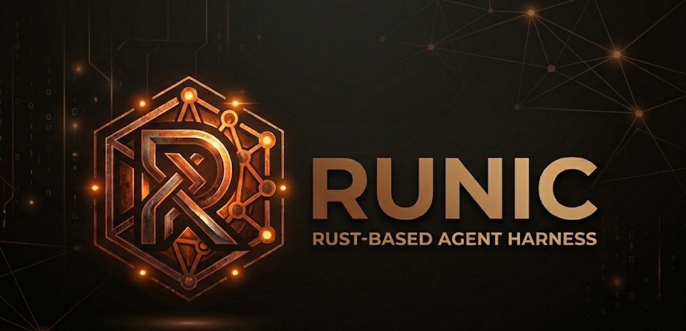

<p align="center">
  
</p>

# runic-dev-ui — dev console

A Leptos CSR (WASM) dev console for `runic serve` — a 3-pane developer UI
instead of curl: thread list, streaming chat with tool-call cards, and a live
state / event inspector.

```
┌───────────┬──────────────────────────┬─────────────────┐
│  threads  │  chat (streaming + tools)│  events / state │
└───────────┴──────────────────────────┴─────────────────┘
```

- **Threads** — create / list / select (per `X-Runic-Tenant`).
- **Chat** — streaming assistant text, collapsible thinking, and **tool-call
  cards** showing the input args + result. When the agent calls `ask_user`
  (HITL), the run parks and an **answer card** appears; your reply POSTs back
  and the run resumes on the same stream.
- **Events** — the run → turn → tool/text tree, clustered (never a raw token
  firehose).
- **State** — the system prompt + the message list *exactly as sent to the
  model*.

Warm-dark by default (toggle with `☾ / ☀`).

## Run it

1. Start a `runic serve` instance (default `http://127.0.0.1:8920`).
2. Serve the UI (it's a Trunk app — built to WASM):
   ```sh
   cd ../runic-dev-ui && trunk serve --open       # http://127.0.0.1:8080
   ```
3. The **server URL** + **tenant** are editable top-left (default
   `http://127.0.0.1:8920`, tenant `default`).

The server's permissive CORS lets the browser app (`:8080`) drive the server
(`:8920`). Events are parsed **leniently as JSON** (the UI switches on each
event's `type` / `kind`), so it stays decoupled from the server's internal
`WireEvent` type.

## Source layout

Split into focused modules: `api` (HTTP/SSE client) · `model` (UI types) ·
`util` · `events` (stream → model folding, with tests) · `views` (render) ·
`app` (the component).

## Requires

`wasm32-unknown-unknown` target and `trunk` (`cargo install trunk`).

## Assets

- `runic-logo.png` — full brand banner (this README).
- `favicon.png` — the sigil mark (browser favicon + sidebar logo).
